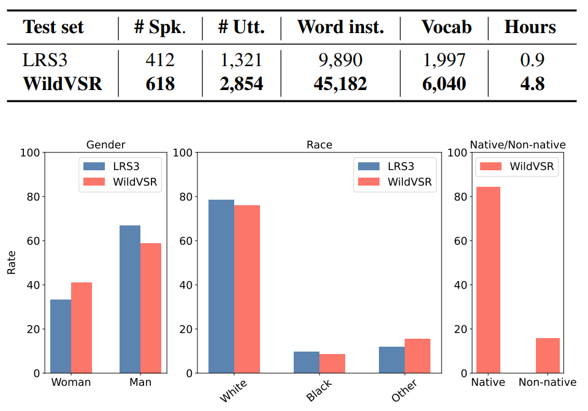

# **Do VSR Models Generalize Beyond LRS3?**

This repository contains our benchmark **WildVSR**, a new test set for Visual Speech Recognition on English, refer to the paper 
[Do VSR Models Generalize Beyond LRS3?](https://arxiv.org/abs/2311.14063).


## Dataset Summary

The Lip Reading Sentences-3 (LRS3) benchmark has primarily been the focus of intense research in visual speech recognition (VSR) during the last few years. As a result, there is an increased risk of overfitting to its excessively used test set, which is only one hour duration. To alleviate this issue, we build **WildVSR**, a new VSR test set by closely following the LRS3 dataset creation processes. We then evaluate and analyse the extent to which the current VSR models generalise to the new test data. We evaluate a broad range of publicly available VSR models and find significant drops in performance on our test set, compared to their corresponding LRS3 results.

Comparison of statistics between LRS3 and WildVSR.




## Downloading the data:

Data can be found at this [link](https://drive.google.com/file/d/1EUx-KffQSLQE5uc5MZaeHKQEZNeHdBwP/view?usp=drive_link). The test set is structured as follows:
```bash
WildVSR/
├── videos/
│ ├── 00001.mp4
│ └── 00002.mp4
├── labels.json

```
The ```labels.json``` has the ```'video_ID': 'label'``` format, where each ```video_ID``` corresponds to the file names in the ```videos``` folder.

You can use the ```wildvsr_test.py``` to load the data, note that all clips are cropped and transformed

```bash
python wildvsr_test.py --wildvsr_path=[path_to_data]
```

## Intended Use

This dataset can be used to test models for visual speech recognition for English. It's particularly useful for research and development purposes in the field of audio-visual content processing. The data can be used to assess the performance of current and future models.

## Limitations and Biases
Due to the data collection process focusing on YouTube, biases inherent to the platform may be present in the dataset. Also, while measures are taken to ensure diversity in content, the dataset might still be skewed towards certain types of content due to the filtering process.

## Ethical Considerations
The dataset only uses free-to-use content, complying with legal requirements and ensuring respect for the original content creators. However, users of the dataset should keep in mind the potential biases and limitations inherent in the dataset.

## Citation
```bash
@article{djilali2023vsr,
  title={Do VSR Models Generalize Beyond LRS3?},
  author={Djilali, Yasser Abdelaziz Dahou and Narayan, Sanath and Bihan, Eustache Le and Boussaid, Haithem and Almazrouei, Ebtessam and Debbah, Merouane},
  journal={arXiv preprint arXiv:2311.14063},
  year={2023}
}
```
